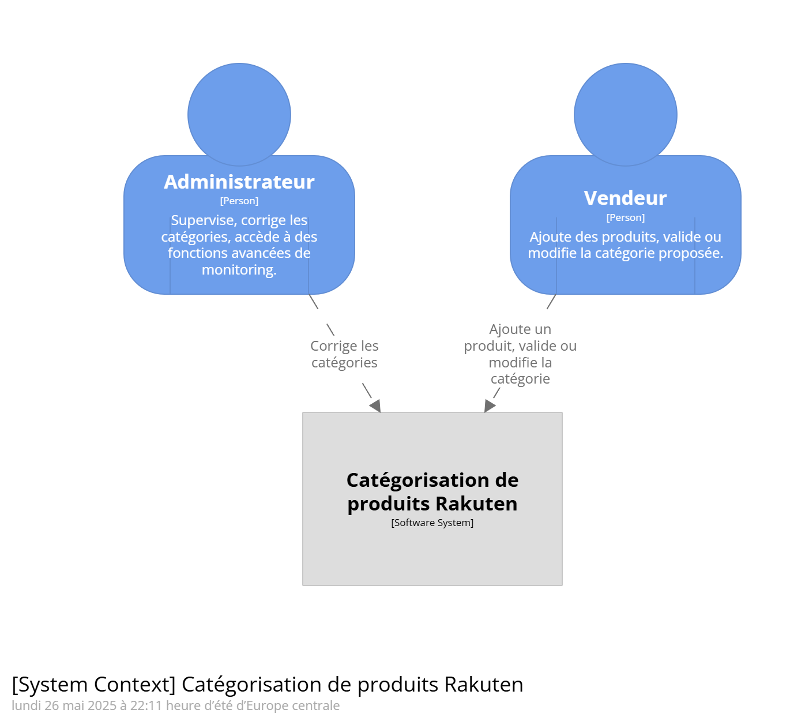
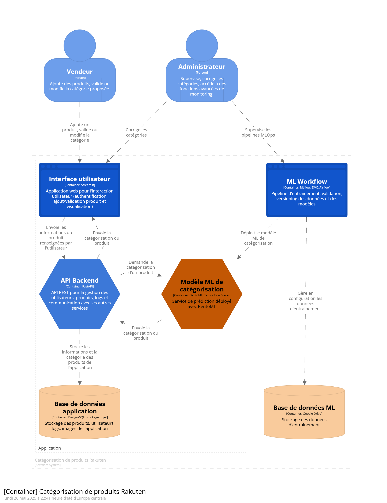

\newpage

# Système de catégorisation de produits Rakuten

---

## 1. Contexte

Ce document présente l'architecture d'un système de catégorisation automatique des produits, destiné à la plateforme Rakuten. L'objectif principal est d'améliorer la qualité de la recherche, de la recommandation, de la gestion du catalogue et du référencement en automatisant la classification des produits à partir de données textuelles et d'images fournies par les vendeurs.

Le projet répond aux besoins de fiabilisation de la catégorisation des produits de Rakuten pour optimiser la recherche, la recommandation, la gestion du catalogue et le référencement. Le jeu de données comprend environ 99 000 produits à classer dans plus de 1 000 catégories.

**Objectifs spécifiques** :

* Améliorer la précision de la catégorisation des produits.
* Réduire le temps de traitement des nouveaux produits.
* Augmenter la satisfaction des vendeurs et des clients.

**Bénéfices attendus** :

* Meilleure expérience utilisateur.
* Augmentation des ventes grâce à une meilleure recommandation.
* Réduction des coûts opérationnels.

**Jeu de données** :

* Données textuelles : 60 MB de fichiers CSV contenant la description des produits
* Données images : 2,2 GB d’images des produits au format JPEG

L’architecture cible doit être modulaire, conteneurisée, supervisée et permettre le réentraînement automatisé des modèles.

---

## 2. Expression du besoin

### 2.1 Exigences fonctionnelles

* Ajout d’un produit (description et image) via une interface Web
* Classification automatisée du produit selon les catégories du site Rakuten
* Administration du système pour contrôler les différentes métriques du modèle de classification

### 2.2 Exigences non fonctionnelles

* Détection et réentraînement en cas de dérive du modèle de catégorisation
* Scalabilité pour volumes croissants
* Monitoring et alerting en production
* Versioning et traçabilité des modèles IA

---

## 3. Architecture fonctionnelle

### 3.1 Écosystème

Ce paragraphe décrit l'écosystème dans lequel s'inscrit le système. Le diagramme de contexte C4 est utilisé pour illustrer les interactions entre les différents systèmes et acteurs.

### 3.2 Acteurs

* **Vendeur** : ajoute un produit (image, titre, description), valide ou modifie la catégorie proposée, donne un feedback sur la qualité de la prédiction.
* **Administrateur** : supervise, corrige manuellement les catégories, accède aux fonctions avancées de monitoring et d’audit.

### 3.3 Cas d’usage

#### 3.3.1 Authentification

En tant qu'utilisateur, je veux pouvoir me connecter au système avec mes identifiants, afin d'accéder aux fonctionnalités du système.

1. L'utilisateur saisit ses identifiants (email, mot de passe).
2. Le système vérifie les identifiants.
3. Si les identifiants sont valides, l'utilisateur est authentifié et accède au système.
4. Si les identifiants sont invalides, un message d'erreur est affiché.

**Flux alternatifs** :

* A1 : Identifiants invalides → message d’erreur.
* A2 : Compte bloqué → message d’erreur.

#### 3.3.2 Ajout de produit par le Vendeur

En tant que vendeur, je veux ajouter un produit avec une image, un titre et une description, afin que le système puisse le classer automatiquement dans la bonne catégorie.

1. Le vendeur saisit les informations produit et téléverse une image.
2. Le produit est enregistré en base.
3. La classification IA est déclenchée.
4. La catégorie prédite et son score de confiance sont affichés.

**Flux alternatifs** :

* A1 : Image absente → message d’erreur.
* A2 : Score faible → validation manuelle requise.
* A3 : Sélection manuelle d’une autre catégorie.

#### 3.3.3 Modification de catégorie par l’Administrateur

En tant qu'administrateur, je veux pouvoir rechercher et modifier la catégorie d'un produit, afin de corriger les erreurs de classification.

1. L’administrateur accède à l’interface d’administration.
2. Il recherche et sélectionne un produit.
3. Il modifie la catégorie.
4. La modification est enregistrée.

**Flux alternatifs** :

* A1 : Produit introuvable → message d’erreur.
* A2 : Catégorie non valide → message d’erreur avec liste autorisée.

#### 3.3.4 Réentraînement du modèle IA

De manière automatisée, je veux que le système détecte automatiquement les dérives de données et de concept, afin de déclencher le réentraînement des modèles IA.

1. Collecte des prédictions et corrections manuelles.
2. Analyse pour détection de dérive (data & concept drift).
3. Si dérive détectée, déclenchement du pipeline de réentraînement.
4. Validation et déploiement du nouveau modèle.

**Flux alternatifs** :

* A1 : Échec de l’entraînement → notification aux équipes.
* A2 : Nouvelle version moins performante → maintien de la version précédente.

#### 3.3.5 Gestion des logs et traçabilité

En tant qu’administrateur, je veux pouvoir accéder à l’historique des actions, des prédictions et des corrections, afin d’assurer la traçabilité et l’audit du système.

1. Toutes les actions utilisateurs et systèmes sont loguées.
2. Les logs sont stockés en base et/ou dans un stockage dédié.
3. Les administrateurs peuvent consulter les logs pour audit ou analyse.

### 3.4 Blocs fonctionnels

#### 3.4.1 Interface utilisateur

* **Description** : Interface web permettant aux utilisateurs d'interagir avec le système.
* **Fonctionnalités** :
  * Authentification des utilisateurs.
  * Ajout et modification des produits.
  * Visualisation des catégories prédites.

#### 3.4.2 API Backend

* **Description** : API backend pour gérer les requêtes et les réponses entre l'interface utilisateur et les services de prédiction.
* **Fonctionnalités** :
  * Gestion des requêtes d'authentification.
  * Gestion des requêtes d'ajout et de modification de produits.
  * Gestion des requêtes de prédiction de catégories.
  * Gestion centralisée des logs et des événements (audit, traçabilité).

#### 3.4.3 Service de prédiction

* **Description** : Service de prédiction pour classer les produits dans les catégories appropriées.
* **Fonctionnalités** :
  * Réception des données de produits.
  * Prédiction des catégories.
  * Retour des catégories prédites et des scores de confiance.

#### 3.4.4 Pipeline ML et versioning

* **Description** : Pipeline pour l'entraînement, la validation et le déploiement des modèles de machine learning.
* **Fonctionnalités** :
  * Collecte des prédictions et corrections manuelles.
  * Détection de dérive de données et de concept.
  * Réentraînement des modèles.
  * Stocke et versionne les données d'entrainement et les modèles.

#### 3.4.5 Monitoring & alerting

* **Description** : Système de monitoring et d'alerting pour surveiller les performances et la qualité des modèles.
* **Fonctionnalités** :
  * Collecte des métriques de performance.
  * Détection des dérives de données et de concept.
  * Alerting en cas de dérive détectée.

#### 3.4.6 Base de données

* **Description** : Base de données pour persister les données des produits.
* **Fonctionnalités** :
  * Stockage des données des produits.
  * Récupération des données des produits.

### 3.6 Description des données

#### 3.6.1 Données textuelles

* **Flux de données** : Input (titre, description), Output (catégorie prédite, score de confiance).
* **Nature** : Informations descriptives des produits.
* **Origine** : Fournies par les vendeurs.
* **Sensibilité** : Données sensibles.
* **Persistance** : Les données textuelles doivent être persistées pour permettre la classification, l'entraînement des modèles et la consultation depuis l'interface.

#### 3.6.2 Données images

* **Flux de données** : Input (images), Output (catégorie prédite, score de confiance).
* **Nature** : Images des produits.
* **Origine** : Fournies par les vendeurs.
* **Sensibilité** : Données sensibles.
* **Persistance** : Les données images doivent être persistées pour permettre la classification, l'entraînement des modèles et la consultation depuis l'interface.
* Les images sont stockées dans un stockage objet ou externe, référencées en base.

#### 3.6.3 Logs et feedback utilisateur

* **Flux de données** : Input (actions, feedback), Output (audit, monitoring, alerting).
* **Nature** : Logs applicatifs, feedback utilisateur.
* **Origine** : Générés par l’API Backend et l’interface utilisateur.
* **Sensibilité** : Données sensibles (audit, conformité).
* **Persistance** : Stockés en base et/ou dans un stockage dédié.

---

## 4. Architecture logicielle

### 4.1 Diagramme de conteneurs

Le diagramme d'architecture logicielle du système montre les différentes unités de déploiement (applications, API, base de données, versionning des données et modèles ML) et leurs interactions.

### 4.2 Flux de données entre les conteneurs

Les flux de données entre les différents conteneurs sont décrits ci-dessous :

* **Interface utilisateur ↔ API Backend** :

  * **Protocole** : HTTPS
  * **Format** : JSON
  * **Technologie** : REST API

* **API Backend ↔ Service de prédiction** :

  * **Protocole** : HTTPS
  * **Format** : JSON
  * **Technologie** : REST API

* **API Backend ↔ Base de données** :

  * **Protocole** : PostgreSQL
  * **Format** : SQL
  * **Technologie** : PostgreSQL

* **Service de prédiction ↔ Pipeline ML et versioning** :

  * **Protocole** : HTTPS
  * **Format** : HDF5 pour les modèles, CSV pour les données d'entraînement
  * **Technologie** : REST API

* **Pipeline ML et versioning ↔ Monitoring & alerting** :

  * **Protocole** : HTTPS
  * **Format** : JSON
  * **Technologie** : REST API

* **Pipeline ML et versioning ↔ Google Drive** :

  * **Protocole** : HTTPS
  * **Format** : HDF5 pour les modèles, CSV pour les données d'entraînement
  * **Technologie** : Google Drive API

* **API Backend ↔ Monitoring & alerting** :

  * **Protocole** : HTTPS
  * **Format** : JSON
  * **Technologie** : REST API
  * **Usage** : Transmission des métriques d’usage, logs.

* **API Backend ↔ Stockage externe** :

  * **Protocole** : HTTPS
  * **Format** : JSON, fichiers (HDF5, CSV, images)
  * **Technologie** : Google Drive API
  * **Usage** : Sauvegarde/restauration de modèles, images.

### 4.3 Interface utilisateur

#### 4.3.1 Diagramme de composants

Le diagramme de composants du conteneur d'interface utilisateur montre les différents composants et leurs interactions. Les composants principaux incluent :

* **Composant d'authentification** : Gère l'authentification des utilisateurs.
* **Composant d'ajout de produit** : Gère l'ajout de produits.
* **Composant de visualisation** : Gère la visualisation des catégories prédites.

#### 4.3.2 Choix technologiques

* **Solution** : Streamlit
* **Justification** : Streamlit est une bibliothèque Python open-source qui permet de créer des applications web interactives rapidement et facilement. Elle est idéale pour les interfaces utilisateur nécessitant une interaction avec des modèles de machine learning.

### 4.4 API Backend

#### 4.4.1 Diagramme de composants

Le diagramme de composants du conteneur API Backend montre les différents composants et leurs interactions. Les composants principaux incluent :

* **Composant de gestion des requêtes** : Gère les requêtes d'authentification, d'ajout et de modification de produits, et de prédiction de catégories.

#### 4.4.2 Choix technologiques

* **Solution** : FastAPI
* **Justification** : FastAPI est un framework moderne, rapide (hautes performances) pour construire des API avec Python 3.6+ basé sur les annotations de type standard Python. Il est idéal pour créer des API robustes et performantes.

### 4.5 Service de prédiction

#### 4.5.1 Diagramme de composants

Le diagramme de composants du conteneur de service de prédiction montre les différents composants et leurs interactions. Les composants principaux incluent :

* **Composant de réception des données** : Reçoit les données de produits.
* **Composant de prédiction** : Prédit les catégories.
* **Composant de retour des résultats** : Retourne les catégories prédites et les scores de confiance.

#### 4.5.2 Choix technologiques

* **Solution** : BentoML, TensorFlow/Keras
* **Justification** :
  * **BentoML** : Plateforme open-source pour le déploiement et la gestion de modèles de machine learning. Elle permet de packager les modèles et de les déployer facilement, ce qui est essentiel pour un système de prédiction.
  * **TensorFlow/Keras** : Bibliothèques open-source pour la création et l'entraînement de modèles de machine learning. Elles sont idéales pour la création de modèles de prédiction.

### 4.6 Pipeline ML et versioning

#### 4.6.1 Diagramme de composants

Le diagramme de composants du conteneur de pipeline ML et versioning montre les différents composants et leurs interactions. Les composants principaux incluent :

* **Composant de collecte des prédictions** : Collecte les prédictions et corrections manuelles.
* **Composant de détection de dérive** : Détecte les dérives de données et de concept.
* **Composant de réentraînement** : Réentraîne les modèles.

#### 4.6.2 Choix technologiques

* **Solution** : MLflow, DVC, Airflow
* **Justification** :
  * **MLflow** : Plateforme open-source pour la gestion du cycle de vie des projets de machine learning, y compris l'expérimentation, la reproductibilité et le déploiement.
  * **DVC** : Outil de versioning de données et de gestion de pipelines de machine learning, intégré avec Git.
  * **Airflow** : Plateforme pour programmer et surveiller des workflows, idéale pour l'orchestration des pipelines de machine learning.

### 4.7 Monitoring & alerting

#### 4.7.1 Diagramme de composants

Le diagramme de composants du conteneur de monitoring & alerting montre les différents composants et leurs interactions. Les composants principaux incluent :

* **Composant de collecte des métriques** : Collecte les métriques de performance.
* **Composant de détection des dérives** : Détecte les dérives de données et de concept.
* **Composant d'alerting** : Alerte en cas de dérive détectée.

#### 4.7.2 Choix technologiques

* **Solution** : Evidently, Prometheus, Grafana
* **Justification** :
  * **Evidently** : Outil pour le monitoring et l'analyse de la qualité des données et des modèles de machine learning.
  * **Prometheus** : Système de monitoring et d'alerting open-source, idéal pour la collecte de métriques.
  * **Grafana** : Plateforme de visualisation et d'analyse de données, souvent utilisée avec Prometheus pour créer des tableaux de bord interactifs.

### 4.8 Base de données Produits

#### 4.8.1 Modèle de données

* **Produit** : id, titre, description, image_url, catégorie_prédite, score_confiance, catégorie_validée, feedback, date_ajout, date_modification
* **Utilisateur** : id, email, mot_de_passe_hash, rôle, date_creation, date_dernière_connexion
* **Logs** : id, utilisateur_id, action, date, détails
* **Modèle** : id, version, date_entrainement, score, chemin_stockage

#### 4.8.2 Choix technologiques

* **Solution** : PostgreSQL
* **Justification** : PostgreSQL est un système de gestion de base de données relationnelle open-source, idéal pour persister les données des produits qui sont ajoutés et affichés dans Streamlit.

---

## 5. Architecture technique

### 5.1 Infrastructure

* **Configuration matérielle** :

  * **Système d'exploitation** : Windows 11
  * **Caractéristiques de disponibilité et de résilience** : Utilisation de Docker et Kubernetes pour la conteneurisation et l'orchestration des conteneurs.
  * **Sauvegarde et récupération** : Sauvegardes régulières pour assurer la récupération des données en cas de défaillance.

* **Stockage externe** : Google Drive ou S3 pour les modèles, datasets, images volumineuses.

### 5.2 Sécurité et Sauvegarde

* Les conteneurs Docker sont sécurisés avec des politiques de sécurité.
* Des sauvegardes régulières sont effectuées pour assurer la récupération des données.
* Gestion des droits d’accès par rôle (vendeur, administrateur).
* Chiffrement des données sensibles (mots de passe, logs).
* Audit et traçabilité via la gestion centralisée des logs.

---

## 6. Architecture opérationnelle

### 6.1 Monitoring et Alerting

* **Prometheus** :

  * **Collecte des métriques** : Collecte des métriques de performance des conteneurs et des applications.
  * **Alertes** : Configuration d'alertes pour les métriques critiques.

* **Grafana** :

  * **Tableaux de bord** : Création de tableaux de bord pour visualiser les métriques en temps réel.
  * **Alertes** : Intégration avec Prometheus pour les alertes.

* **Evidently** :

  * **Détection de dérive** : Détection des dérives de données et de concept.
  * **Alertes** : Alertes en cas de dérive détectée.

### 6.2 Maintenance et Mise à jour

* **Mises à jour des modèles IA** :

  * **Fréquence** : Mises à jour mensuelles.
  * **Tests de régression** : Tests de régression pour assurer la qualité des nouvelles versions des modèles.

* **Procédures de maintenance** :

  * **Documentation** : Procédures de maintenance documentées.
  * **Suivi** : Suivi des procédures de maintenance.

---

## 7. Annexes

### Glossaire

* **prdtypecode** : Code de type de produit
* **imageid** : Identifiant unique de l'image

### Liens utiles

* [GitHub](https://github.com/slanoe/mlops_classification_e-commerce)
* [DagsHub](https://dagshub.com/stevenlanoe/mlops_classification_e-commerce)
* [DVC](https://dvc.org/)
* [MLflow](https://mlflow.org/)
* [Grafana](https://grafana.com/)
